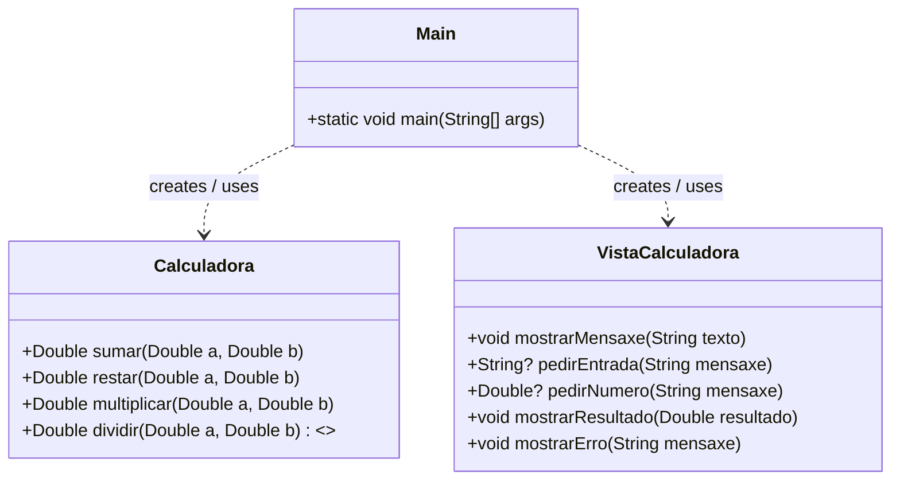

```mermaid
classDiagram

class Calculadora {
  +Double sumar(Double a, Double b)
  +Double restar(Double a, Double b)
  +Double multiplicar(Double a, Double b)
  +Double dividir(Double a, Double b) <<throws IllegalArgumentException>>
}

class VistaCalculadora {
  +void mostrarMensaxe(String texto)
  +String? pedirEntrada(String mensaxe)
  +Double? pedirNumero(String mensaxe)
  +void mostrarResultado(Double resultado)
  +void mostrarErro(String mensaxe)
}

class Main {
  +static void main(String[] args)
}

%% Relacións / dependencias detectadas no código
Main ..> Calculadora : creates / uses
Main ..> VistaCalculadora : creates / uses

%% Nota: as relacións son de dependencia (Main crea instancias de Calculadora e VistaCalculadora).

```
