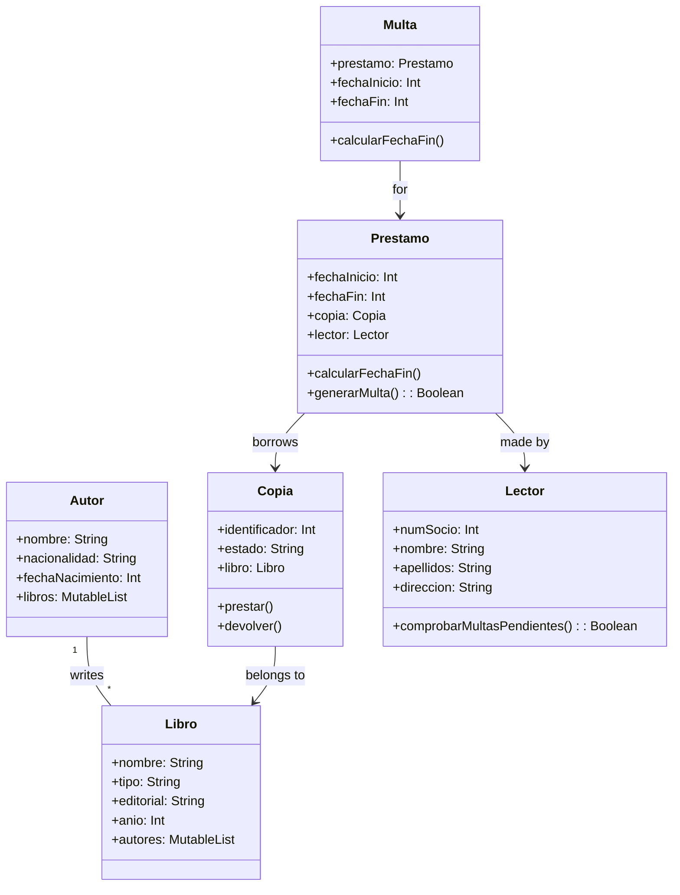

```mermaid
classDiagram
    class Autor {
        +nombre: String
        +nacionalidad: String
        +fechaNacimiento: Int
        +libros: MutableList<Libro>
    }

    class Libro {
        +nombre: String
        +tipo: String
        +editorial: String
        +anio: Int
        +autores: MutableList<Autor>
    }

    class Copia {
        +identificador: Int
        +estado: String
        +libro: Libro
        +prestar()
        +devolver()
    }

    class Lector {
        +numSocio: Int
        +nombre: String
        +apellidos: String
        +direccion: String
        +comprobarMultasPendientes(): Boolean
    }

    class Prestamo {
        +fechaInicio: Int
        +fechaFin: Int
        +copia: Copia
        +lector: Lector
        +calcularFechaFin()
        +generarMulta(): Boolean
    }

    class Multa {
        +prestamo: Prestamo
        +fechaInicio: Int
        +fechaFin: Int
        +calcularFechaFin()
    }

    Autor "1" -- "*" Libro : writes
    Copia --> Libro : belongs to
    Prestamo --> Copia : borrows
    Prestamo --> Lector : made by
    Multa --> Prestamo : for
```