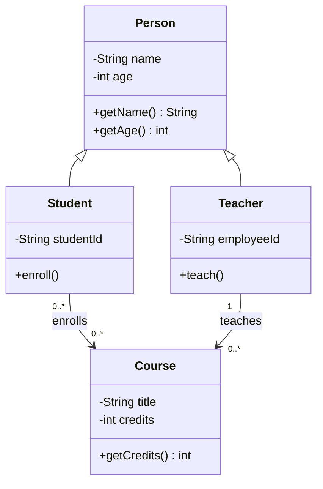

```mermaid
classDiagram
    class Person {
        -String name
        -int age
        +getName() String
        +getAge() int
    }

    class Student {
        -String studentId
        +enroll()
    }

    class Teacher {
        -String employeeId
        +teach()
    }

    class Course {
        -String title
        -int credits
        +getCredits() int
    }

    Person <|-- Student
    Person <|-- Teacher
    Student "0..*" --> "0..*" Course : enrolls
    Teacher "1" --> "0..*" Course : teaches
```