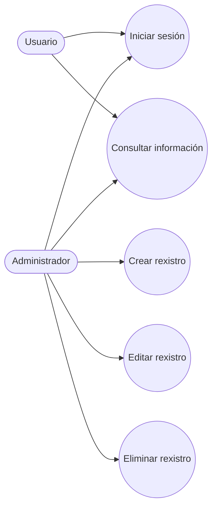

```mermaid
flowchart LR
    actorUsuario([Usuario])
    actorAdmin([Administrador])

    casoLogin((Iniciar sesión))
    casoConsultar((Consultar información))
    casoCrear((Crear rexistro))
    casoEditar((Editar rexistro))
    casoEliminar((Eliminar rexistro))

    actorUsuario --> casoLogin
    actorUsuario --> casoConsultar

    actorAdmin --> casoLogin
    actorAdmin --> casoConsultar
    actorAdmin --> casoCrear
    actorAdmin --> casoEditar
    actorAdmin --> casoEliminar
``` 