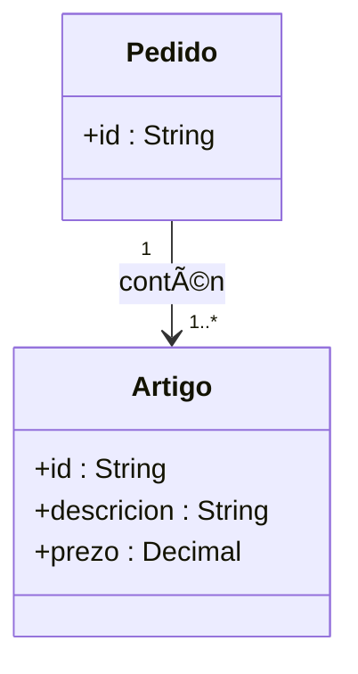
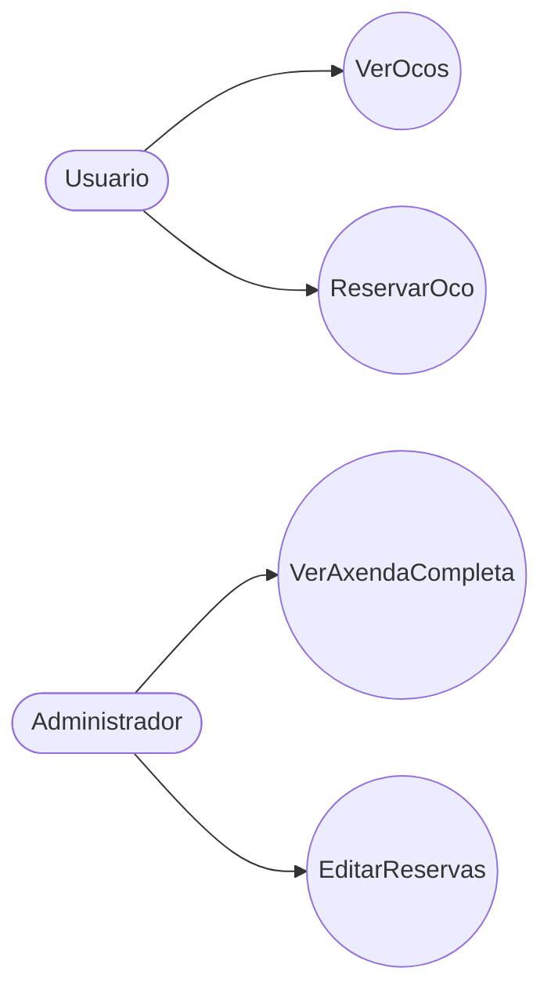

```mermaid
classDiagram

class Pedido {
  +id : String
}

class Artigo {
  +id : String
  +descricion : String
  +prezo : Decimal
}

Pedido "1" --> "1..*" Artigo : contén
```

```mermaid

flowchart LR

    actorUsuario([Usuario])
    actorAdmin([Administrador])

    casoVerOcos((VerOcos))
    casoReservarOco((ReservarOco))

    casoVerAxendaCompleta((VerAxendaCompleta))
    casoEditarReservas((EditarReservas))

    actorUsuario --> casoVerOcos
    actorUsuario --> casoReservarOco

    actorAdmin --> casoVerAxendaCompleta
    actorAdmin --> casoEditarReservas

```