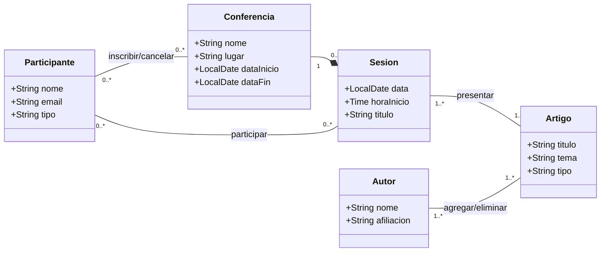

```mermaid
classDiagram

direction LR

class Conferencia {
  +String nome
  +String lugar
  +LocalDate dataInicio
  +LocalDate dataFin
}

class Sesion {
  +LocalDate data
  +Time horaInicio
  +String titulo
}

class Participante {
  +String nome
  +String email
  +String tipo
}

class Artigo {
  +String titulo
  +String tema
  +String tipo
}

class Autor {
  +String nome
  +String afiliacion
}


%% Relacións
Conferencia "1" --* "0..*" Sesion

Participante "0..*" -- "0..*" Sesion: participar
Participante "0..*" -- "0..*" Conferencia: inscribir/cancelar

Sesion "1..*" -- "1..*" Artigo : presentar

Autor "1..*" -- "1..*" Artigo : agregar/eliminar
```